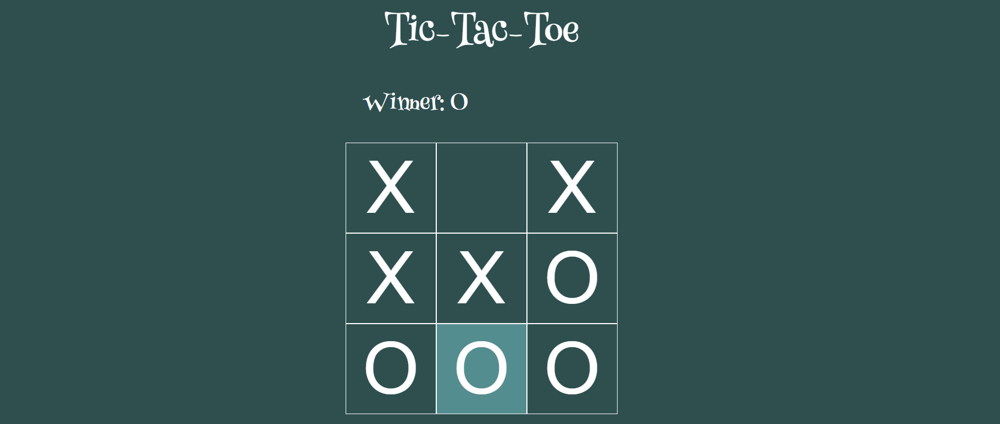

# Tic-Tac-Toe
A Web-Dev oriented Game.

[Go to the Testing Web Site - https://tic-tac-toe-app-42f83.web.app/](https://tic-tac-toe-app-42f83.web.app/)

## Motivation :

Contribution brings happiness to world and learning new things leads to skill development!

## Tools Used :

Just any Text-editor, I prefer Sublime text and Web Browser Chrome.

## Technologies :

Languages: HTML CSS, and Javascript.

Front-end Library: ReactJs

Deployment: Firebase

## Sample-Running App :

Feel free to just add the `.md` file alone.

## Available Scripts

In the project directory, you can run:

### `npm start`

Runs the app in the development mode.\
Open [http://localhost:3000](http://localhost:3000) to view it in the browser.

The page will reload if you make edits.\
You will also see any lint errors in the console.

### `npm run build`

Builds the app for production to the `build` folder.\
It correctly bundles React in production mode and optimizes the build for the best performance.

The build is minified and the filenames include the hashes.\
Your app is ready to be deployed!

Feel free to just add the `.md` file alone.

### Deployment

This is done using Firebase

